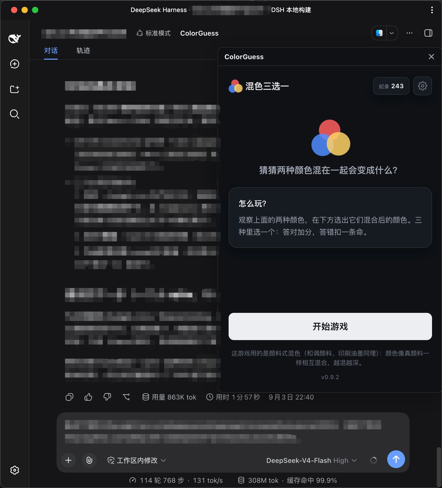

# colorguess-dsh-plugin

[](https://dsh-plugin.org/plugins/HDNRAY/dsh-plugin-colorguess)
[](LICENSE)

> **非官方社区插件**，由社区成员独立开发和维护，与 DeepSeek 官方无隶属关系。
> **Unofficial community plugin**, independently developed and maintained; not affiliated with DeepSeek.

**一句话价值**：等模型出结果时，在会话里随手来一局「混色三选一」—— 不用切换应用，也不打断心流。

**One-line value**: play a quick "mix two colors, pick the result" round while you wait for the model — no app switching, no context loss.

**能力分类 / Category**：娱乐 / Entertainment

ColorGuess 的 DeepSeek Harness (DSH) 插件：在会话头部加一个 "ColorGuess" 按钮，点击打开**可拖动的悬浮窗**，以 iframe 内嵌游戏。游戏本体托管在 GitHub Pages（本插件不含游戏代码，只负责嵌入与主题同步）。

A DeepSeek Harness (DSH) plugin for ColorGuess: a session-header "ColorGuess" button that opens the game in a **draggable floating window** via iframe. The game itself is hosted on GitHub Pages — this plugin only embeds it and forwards the host theme.

## 截图 / Screenshot



会话头部点开 ColorGuess，等结果的时候来一局；窗口跟随 DSH 的亮/暗主题。

## 安装 / Install

通过 git 仓库安装（本仓库为 public），profile 用 `web`：

```bash
dsh plugin --profile web add github:HDNRAY/dsh-plugin-colorguess
# 然后重启 dsh web
```

重启后，在会话头部（聊天页右上角操作区）会出现 **ColorGuess** 按钮，点击打开悬浮窗内嵌游戏。

更新插件（代码或 `lib/` 有新版后）：

```bash
dsh plugin --profile web update colorguess-dsh-plugin
# 然后重启 dsh web
```

## 功能 / Features

- 可拖动的悬浮窗（拖动标题栏移动，左下 / 右下两个角缩放，✕ / Esc 关闭）
- 主题同步：游戏跟随 DSH 的亮/暗主题（postMessage 协议 `{ source: 'colorguess-dsh', theme }`）
- 不占用会话区域：关闭后不留痕迹

## 权限与外部服务 / Permissions & external services

- **不申请任何特殊权限**：不读写本地文件、不访问会话内容、不注入或修改 prompt，只在会话头部渲染一个按钮和一个悬浮窗。
- **外部服务**：悬浮窗内的游戏页面从 GitHub Pages 加载，需要联网。
- **匿名统计**：游戏页面内含匿名访问统计（[Umami](https://umami.is)），仅记录页面访问与游戏内事件（开始、作答、结束等），不使用 Cookie 做跨站追踪，也不采集账号、会话内容或任何个人信息。
- **主题转发**：只把 DSH 当前的亮/暗主题通过 postMessage 传给游戏页面用于配色。

## 兼容与运行要求 / Compatibility

- **DSH**：在 `0.1.2-alpha.2` 上开发与验证。
- **平台 / Profile**：`web`（浏览器端插件，无小程序 / 原生端实现）。
- **运行环境**：现代浏览器 + 联网（游戏页面托管在 GitHub Pages）。

## 开发 / Development

```bash
npm install          # 仅安装 esbuild（构建用）
npm run build        # 重新构建 lib/index.js + lib/client.js
```

`lib/` 已提交，直接 git 安装即可用；修改 `src/` 后重新构建并提交 `lib/`。**main 分支受保护（PR 审核）**：改动请走 PR。仓库的 sync-lib workflow 会在 main 更新后自动重建 `lib/` 并开一个 "chore: rebuild lib" 的 PR，合并后安装者即可拿到新构建。

## 贡献 / Contributing

- main 分支禁直推：所有改动通过 Pull Request
- 改动 `src/` 后本地跑 `npm run build` 并提交 `lib/`，或交给 sync-lib workflow 自动重建

## 结构 / Structure

- `src/index.ts` — 宿主端（空 apply，让插件进入 Loader）
- `src/client/` — 浏览器端：头部按钮 + 悬浮窗 iframe + 主题转发
- `scripts/build.mjs` — 构建脚本（esbuild，产出 `__ModuleLoader__.load` 契约的 client bundle）
- `cordis.patch.yml` — 插件行配置

## 许可 / License

[MIT](LICENSE)
